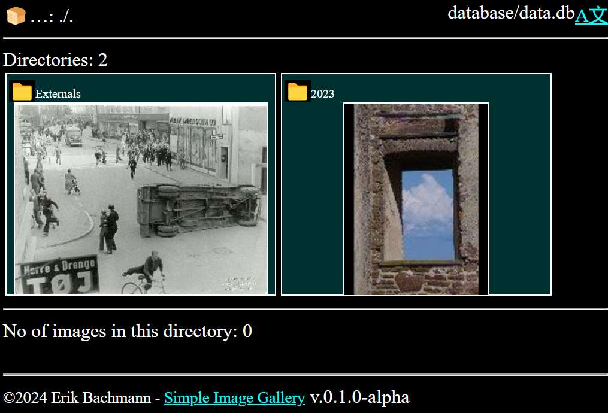
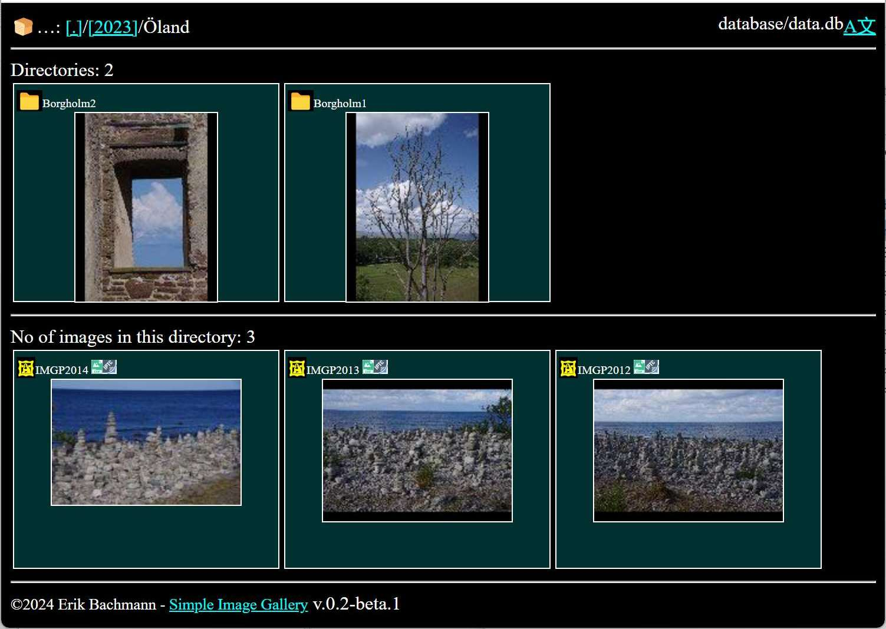
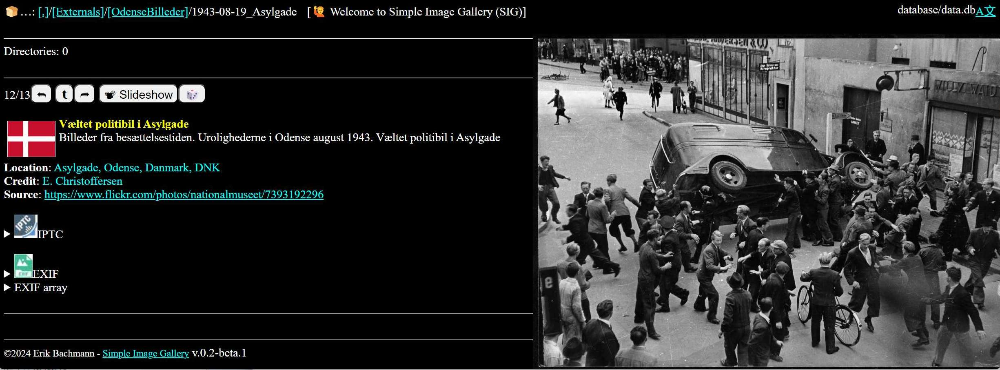
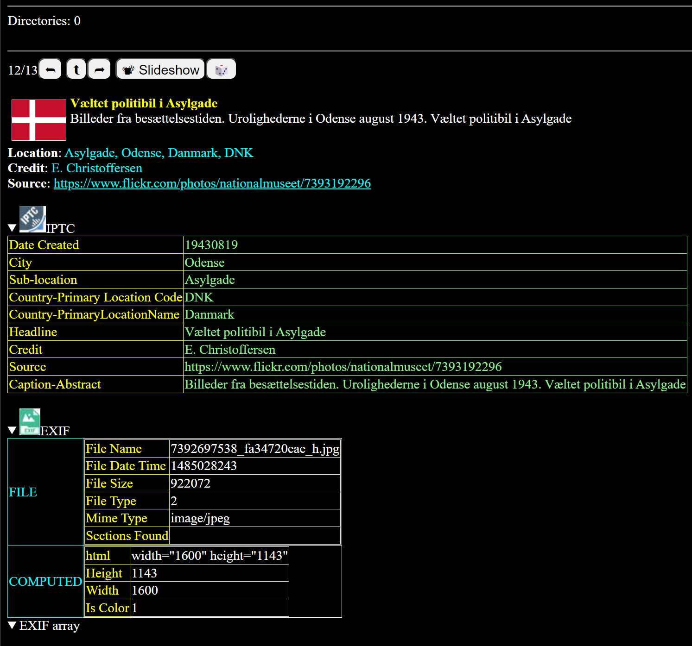
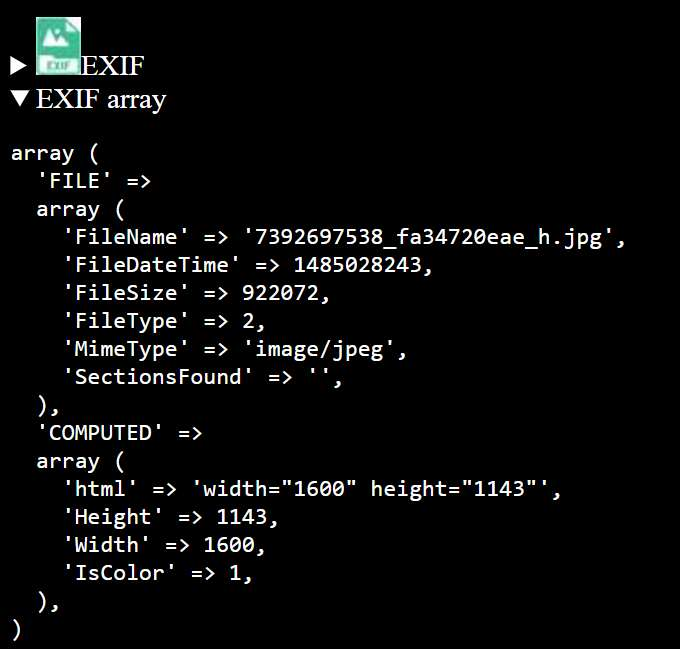

# Simple Image Gallery 	


List and display images by folder showing metadata like EXIF and IPTC from images.

All functionallity is build in PHP, JavaScript and SQL on top of a SQLite database.

This is heavyly inspired by [Single File PHP Gallery](https://sye.dk/sfpg/), but build from scratch.
_Single File PHP Gallery_ is a nice out-of-the-box gallery app. But has it's issues with handling larger collection of images (YES! I'm impatient).

My own collection holds more than 250,000 images. And I do NOT want to load that onto a webserver. 


## Pros and cons of **Simple Image Gallery**

> [!WARNING]  
> Do *NOT* any personal/private images online!!! This is *not* a security system - and you "share with the world" online!


Pros | cons
---|---
Fast loading	| Manual rebuil and database load
Keeps you originals away from the net	| Max display width and height defined by database
Watermarking in database | Requires resizing of ALL images

> [!TIP]
> If you put a watermark into your display images, the original are unaffected.


## Demo

Take a look at the latest [demo](https://gallerydemo.clicketyclick.dk)

### Directory list.
List of subdirectories and individual images



### Image view.
Display an individual image



### IPTC and EXIF metadata.
List IPTC and EXIF metadata

  
  
### EXIF array view.</h3>
List EXIF technical data as array

  

<BR clear=both>


## Setup

```
index.php *     The Gallery
version.txt *   Version identification
LICENSE         License 
.
├───config *    Configuration files.
├───css*        Style Sheets.
├───database*   Database file(s).
├───doc         Documentation.
│   └───HTML    Doxygen doc.
├───examples    Examples for test run
├───icons*      Icons for display.
│   └───.flags* National flags (in SVG).
├───js*         JavaScripts.
├───lib*        Function libraries.
├───sql         SQLscript for administration.
└───util        Utilities: rebuild, reindex.
```

* Files and directories needed on web. If you only run it locally, just ignore.

> [!CAUTION]
> The directories marked * will include a default .htaccess file for Apache servers to prevent users from poking in your data file.


## Startup

Prepare you images in a folder structure (See: `./examples`) like this:

```
.
├───2023
│   ├───Giza
│   ├───Odense
│   └───Öland
│       ├───Borgholm1
│       └───Borgholm2
└───Externals
    ├───DanmarkSetFraLuften
    └───OdenseBilleder
        └───1943-08-19_Asylgade
```

From the root directory of the Gallery run:

```console
php util/rebuild.php 
```

And the database `./database/data.db` will be populated the data from the images in `./examples`:

```console
 *   @file       rebuild.php
 *   @brief      Rebuild database with files and metadata,
 *   @details    Recursive processing file tree.
 *
 *   @todo              Needs a resume action on broken rebuild (WHERE exif IS NULL)
 *
 *   @copyright  http://www.gnu.org/licenses/lgpl.txt LGPL version 3
 *   @author     Erik Bachmann <ErikBachmann@ClicketyClick.dk>
 *   @since      2024-11-11T06:14:36 / ErBa
 *   @version    v.0.1.0-alpha 2024-11-13T07:26:33+00:00

- Image resize type              [scale]
- Process all
- Clear tables
- // Find all image files recursive
[===============================] 100% 31/31 ./examples\Externals\...2296_9f54c9ff59_h.jpg
- Processing files               [31]
- // Write all file names to table
- Update
- // Write meta data, thumb and view for each file
[===============================] 100% 31/31 ./examples/Externals/...2296_9f54c9ff59_h.jpg     -
- Post-processing
[===============================] 100% 26/26 vacuum: --VACUUM;
- Tables created                 [0]
- Images processed               [31]
- Post processes                 [26]
- Runtime                        [00:00:07.5467638969421]
- Log                            [none]
```

You can now test the gallery by:

1. Running php webserver:
```console
php -S localhost:8083
```
2. Opening a broswer window with the address: `http://localhost:8083/index.php`
3. Et voila! The Gallery is up and running.

## Configuration

Suppose that you want to build your own database `./database/xyz` with your own images from `W:/gallery_test/` try setting the arguments to rebuild:

```console
php util/rebuild.php -config:data:data_root="W:/gallery_test/" -config:database:file_name=./database/xyz.db
```

`config:data:data_root` and `config:database:file_name` are the paths to data in the configuration file `./config/config.json`

So you can either set the arguments on the command line - OR edit the configuration file.

(Snap from the configuration file)
```json
{
	"data": {
		"virtual_root": "./",
		"data_root": "W:/gallery_test/",
		"image_ext": [
			"jpg",
			"JPEG"
		]
	},
```
```json
	"database": {
		"file_name": "database/data.db",
		"image_ext": [
			"jpg",
			"JPEG"
		]
	}
}
```


## &#x1F41B;Bugs, quirks &#x1F480; &#x1F47F;  etc. &#x1F4A3;

<dl>
  <dt>Persons</dt>
  <dd>Due to the lack of support of IPTC field "<a href='https://www.iptc.org/std/photometadata/documentation/userguide/#_persons_depicted_in_the_image'>Person Shown</a>" the field "Suplemental Categories" is used.</dd>
</dl>
